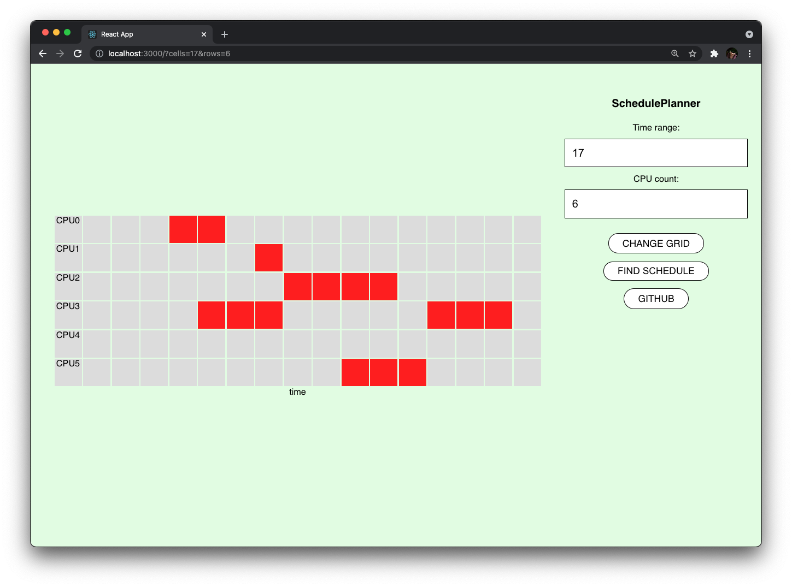

# SchedulePlanner
Schedule planner based on Lee algorithm.

[](https://github.com/oleggr/SchedulePlanner/actions/workflows/tests.yml)
---

### Content

- [Summary](#summary)
- [Usage](#usage)
- [Tests](#tests)
- [Routes](#routes)
- [Contacts](#contacts)

### Summary

App for finding CPU resources for the task. 
Time discretization and cpu count available for customization.
Schedule finder separated from the client app and working on an external processing resource. 
Backend processing power can be increased by vertical and horizontal directions if needed. 
Instructions to do so will be added soon.   




### Usage

Install requirements.
```bash
python3 -m pip install -r requirements.txt
```

Run the server. Server will work on http://localhost:8000
```bash
cd backend
make local
```

Run client. Currently available [web application](https://github.com/oleggr/SchedulePlanner/tree/main/frontend) and CLI script. 
```bash
# Script usage
# Use --help option to see usage hints
pyhton3 query_runner.py strategy1
```

### Tests
Run tests.
```bash
cd backend
python3 -m pip pytest -v
```

### Routes
```
GET    /api/hello        Basic get endpoint
POST   /api/strategy/1   Plan schedule by Strategy 1
                            - body: {
                                field: [[int], [int], ...]
                                end_x: int
                              }
POST   /api/strategy/2   Plan schedule by Strategy 2
                            - Currently not implemented
POST   /api/strategy/3   Plan schedule by Strategy 3
                            - Currently not implemented
```

### Contacts

- Telegram - [@grit4in](https://t.me/grit4in)

[Up](#scheduleplanner)
