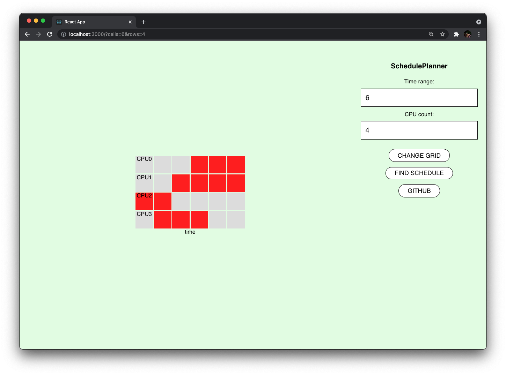
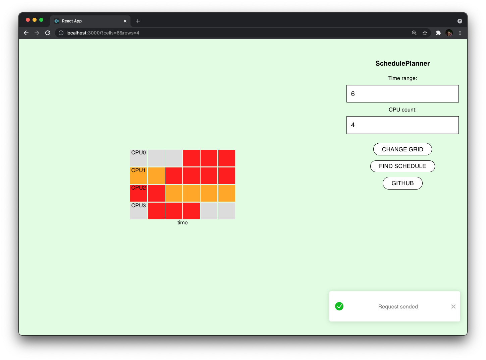

# SchedulePlanner
SchedulePlanner React app.


### Usage
Build and run the app:

```bash
npm run
npm start
```

After that open the site
[http://localhost:3000](http://localhost:3000)

Available query parameters:
- **cells** - time discretisation
- **rows** - count of CPU's

For example:
[http://localhost:3000/?cells=6&rows=4](http://localhost:3000/?cells=6&rows=4)


### Example

App prepared to running schedule finder:




Created schedule after finder running:

